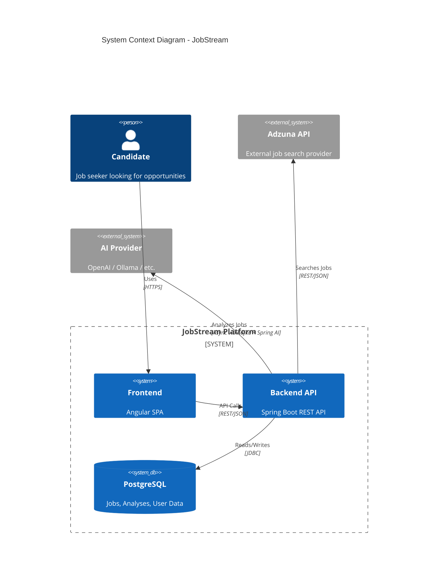
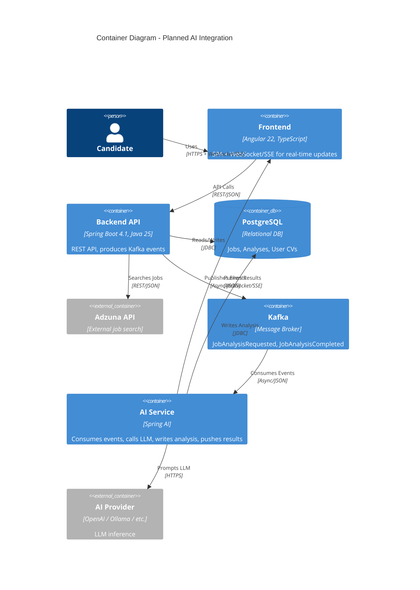
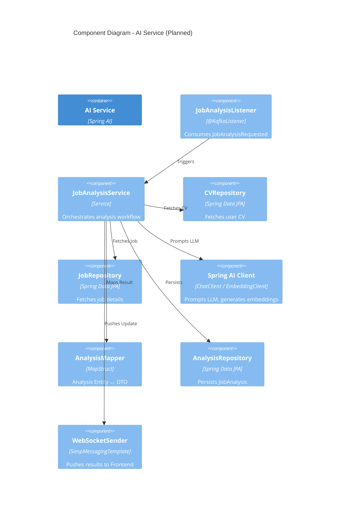

# JobStream

> **Work in Progress** — This project is under active development. Architecture and features described below reflect both current implementation and planned enhancements (AI-powered analysis via Spring AI + Kafka). Details may change.

**JobStream** is a full-stack job search platform built with an **API-First** approach. It allows candidates to:

- **Discover opportunities** by searching external job offers in real time via the **Adzuna API** (keywords, location, pagination)
- **Review details** of any listing (description, salary range, contract type, requirements, original URL)
- **Curate a personal list** by saving relevant offers to a local PostgreSQL database (CRUD with deduplication on external ID)
- **Manage saved jobs** through a paginated, sortable interface

The **OpenAPI 3.1 specification** (`openapi/openapi.yaml`) serves as the single source of truth. Both backend DTOs/interfaces (Spring Boot) and frontend TypeScript clients (Angular) are **generated automatically** at build time, eliminating contract drift.

**Planned AI-powered features** (not yet implemented):
- **Job–CV fit analysis**: Spring AI service evaluates skills match, gaps, seniority alignment
- **Cover letter generation**: Tailored letters per job + candidate profile
- **Async processing**: Kafka decouples the main API from the AI workload for resilience and horizontal scaling
- **Real-time updates**: Analysis results pushed to the frontend via WebSocket/SSE, persisted for history

## Tech Stack

| Layer | Technology |
|-------|------------|
| **Backend** | Spring Boot 4.1, Java 25, PostgreSQL |
| **Frontend** | Angular 22, TypeScript, Angular Material |
| **API Contract** | OpenAPI 3.1 (source of truth) |
| **Code Generation** | OpenAPI Generator (Spring + Angular clients) |
| **Messaging** | Apache Kafka (planned) |
| **AI/ML** | Spring AI (planned) |
| **Testing** | JUnit 5, Testcontainers, Vitest |
| **Quality** | JaCoCo, MapStruct, Lombok |

## Architecture (C4 Model)

### Level 1: System Context

### Level 2: Container Diagram

### Level 3: Component Diagram

## Features

### Implemented
- **External Search**: Query Adzuna API with keywords, location, pagination
- **Job Details**: View full job descriptions from external source
- **Save Jobs**: Persist interesting offers to local database
- **Manage Saved Jobs**: List (paginated, sortable), view, delete saved jobs
- **Global Error Handling**: Consistent RFC 7807-style error responses

### Planned (AI-Powered)
- **Job Analysis**: Spring AI service evaluates job fit against user CV (skills match, gaps, seniority alignment)
- **Cover Letter Generation**: AI writes tailored cover letters per job + CV
- **Async Processing**: Kafka decouples Backend from AI Service for resilience & scalability
- **Real-time Updates**: AI Service pushes analysis results to Frontend via WebSocket/SSE
- **Persisted Analysis**: Results stored in PostgreSQL for history & re-use

## Getting Started (WIP - Details coming soon)

### Prerequisites
- Java 25+
- Node.js 20+ / npm 10+
- PostgreSQL 18

## Key Technical Decisions

| Decision | Rationale |
|----------|-----------|
| **API-First + Code Gen** | Eliminates drift between frontend/backend contracts; single source of truth |
| **Spring RestClient** | Modern, fluent HTTP client (replaces RestTemplate/WebClient for sync calls) |
| **MapStruct** | Compile-time mapping, zero reflection, type-safe |
| **Testcontainers** | Real PostgreSQL in tests, no H2 mismatches |
| **Interface-only generation** | Clean separation: generated interfaces + manual implementations |
| **GlobalExceptionHandler** | Centralized error handling, consistent JSON error format |
| **Kafka (planned)** | Decouples AI workload from main API; enables retry, scaling, resilience |
| **Spring AI (planned)** | Portable AI abstraction; swap providers (OpenAI, Ollama, etc.) without code changes |
| **WebSocket/SSE (planned)** | Real-time AI result delivery to frontend without polling |

## License

MIT