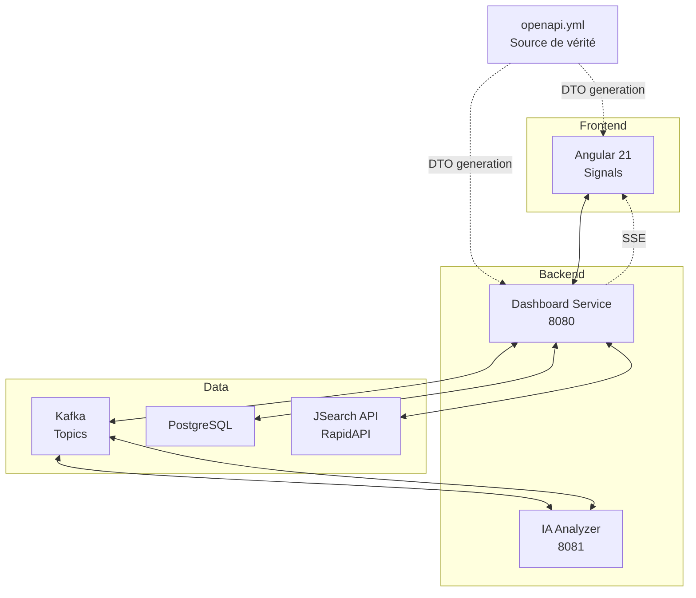
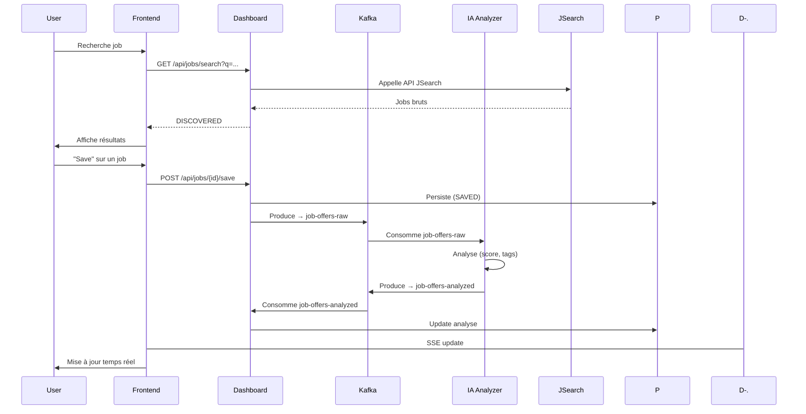
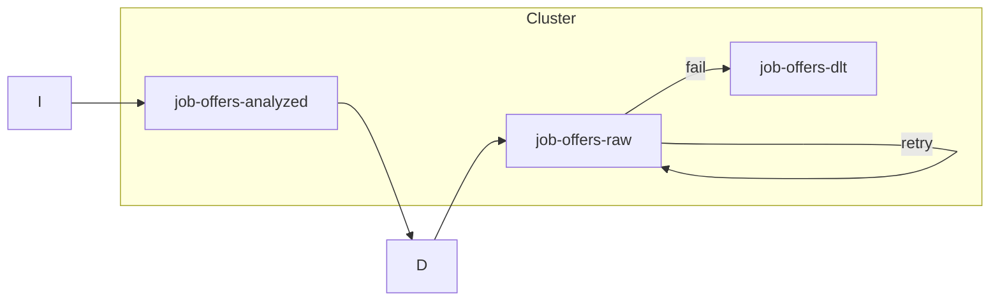
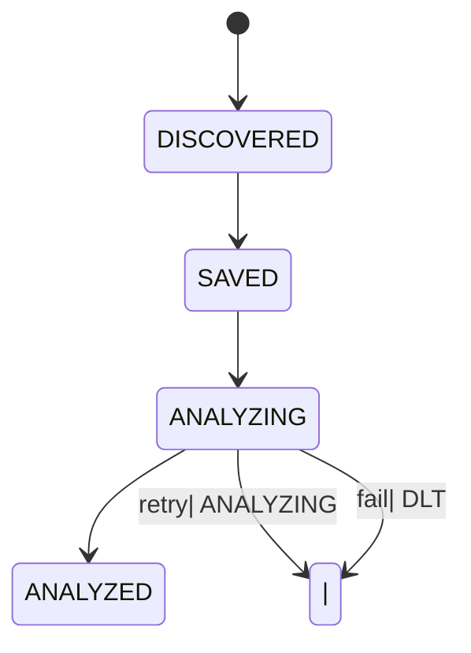
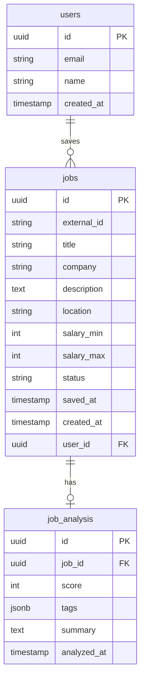

# Architecture JobStream

> Vue d'ensemble technique - Mars 2026

## 1. Vue d'Ensemble

JobStream est une plateforme de recherche d'emploi avec une architecture **event-driven** basée sur Kafka et une approche **API-First**.



---

## 2. Approche API-First

### Principe

**`openapi.yml` est le fichier central** entre Backend et Frontend.

| Action | Outil |
|--------|-------|
| Définir les endpoints | `openapi.yml` |
| Définir les DTOs | `openapi.yml` |
| Générer DTOs Backend | openapi-generator-maven-plugin |
| Générer Client Frontend | openapi-generator-cli |

⚠️ **NE JAMAIS créer de DTOs manuellement**.

### Structure

```
openapi/
└── openapi.yml    # Source de vérité
```

### Endpoints définis

| Méthode | Path | Description |
|---------|------|-------------|
| `GET` | `/api/jobs/search?q=` | Recherche via JSearch |
| `GET` | `/api/jobs` | Liste jobs sauvegardés |
| `POST` | `/api/jobs/{jobId}/save` | Sauvegarder un job |
| `GET` | `/api/jobs/{jobId}` | Détail d'un job |
| `DELETE` | `/api/jobs/{jobId}` | Supprimer un job |
| `GET` | `/api/jobs/stream` | Flux SSE |
| `GET` | `/api/health` | Health check |

### DTOs définis

- `JobDto` - Job brut de l'API
- `SavedJobDto` - Job sauvegardé avec analyse
- `JobAnalysisDto` - Résultat analyse IA
- `JobSearchResponse` - Réponse de recherche
- `JobStatus` - Énumération des statuts

---

## 3. Stack Technique

| Layer | Technology |
|-------|------------|
| Frontend | Angular 21, Signals |
| Backend | Java 21, Spring Boot 3.x |
| Messaging | Apache Kafka 3.x |
| Database | PostgreSQL 15+ |
| Real-time | Server-Sent Events |
| **API Contracts** | **OpenAPI 3.0** (source de vérité) |

---

## 4. Services

### Dashboard Service (8080)
- API REST pour recherche et sauvegarde
- Kafka Producer → `job-offers-raw`
- Kafka Consumer ← `job-offers-analyzed`
- SSE pour updates temps réel
- Génère ses DTOs depuis OpenAPI

### IA Analyzer Service (8081)
- Kafka Consumer ← `job-offers-raw`
- Analyse des jobs (classification, scoring)
- Kafka Producer → `job-offers-analyzed`

---

## 5. Workflow (Smart Cost)



---

## 6. Topics Kafka



| Topic | Partitions | Usage |
|-------|------------|-------|
| `job-offers-raw` | 3 | Jobs sauvegardés |
| `job-offers-analyzed` | 3 | Jobs analysés |
| `job-offers-dlt` | 1 | Dead Letter |

---

## 7. États des Jobs



| Status | Description |
|--------|-------------|
| `DISCOVERED` | Résultat API, non sauvegardé |
| `SAVED` | Sauvegardé par l'utilisateur |
| `ANALYZING` | En cours d'analyse IA |
| `ANALYZED` | Analyse terminée |

---

## 8. Base de Données



---

## 9. API Externe

| API | Provider | Endpoint |
|-----|----------|----------|
| JSearch | RapidAPI | `https://jsearch.p.rapidapi.com/search` |

Config: variable d'environnement `RAPIDAPI_KEY`

---

## 10. Définition de "Done"

- [ ] Code respecte contrat OpenAPI (depuis `openapi.yml`)
- [ ] Tests intégration Testcontainers passent
- [ ] Documentation Swagger à jour